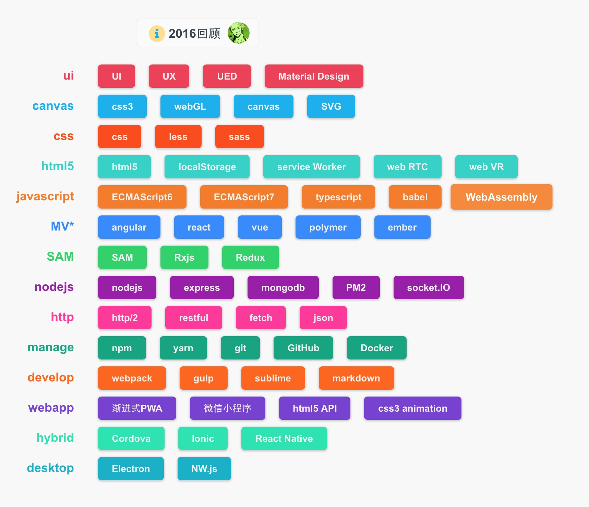

# react-ui-demo
#### 基于react，使用typescript(es6)编写，webpack构建的 react-ui template

## [前端知识点总结](./doc/前端知识点.md)

## Getting start
1. Clone this repo:
`
$ git clone https://github.com/ahyiru/react-ui-demo.git
`

2. Install dependenices:
`
$ npm i
`

3. typings install:
`
$ typings install
`

4. Start the project:
`
$ npm start 		//默认端口8000
`

5. 打开浏览器，访问: [http://localhost:8000/](http://localhost:8000/)

#### 持续更新中...

