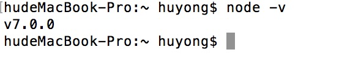
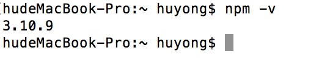
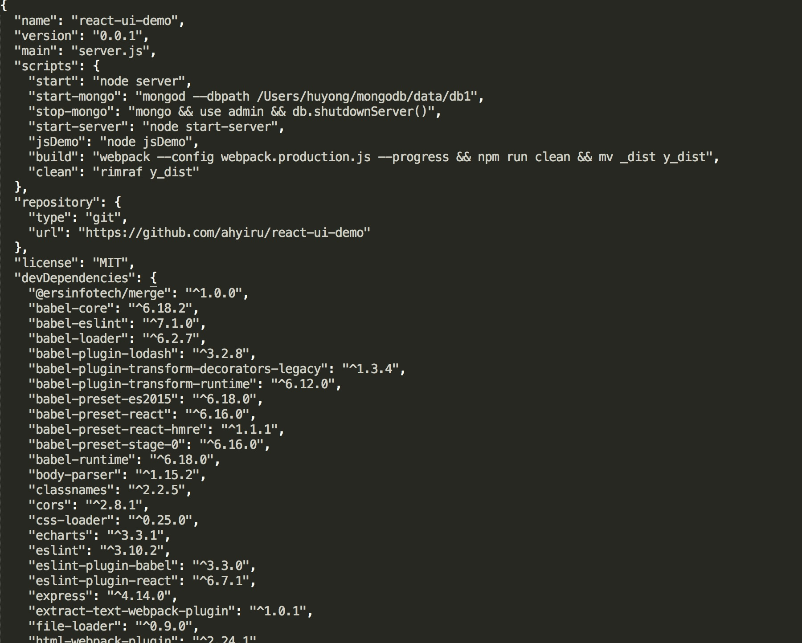

# 前言

## 环境配置

### 使用nodejs运行环境，npm包管理，git进行版本控制，sublime代码编辑器。

### 1.node安装

#### 1.1下载安装 [nodejs](https://nodejs.org/en/)。

安装完成后，运行`node -v`查看当前版本号。
	

	
nodejs安装完成后，自动安装了npm管理工具，运行`npm -v`查看当前版本号。。
	

	
#### 1.2安装cnpm。

npm在国内速度太慢，可以使用淘宝源cnpm代替。
	
安装cnpm：`npm install -g cnpm --registry=https://registry.npm.taobao.org`
	
安装依赖工具：
		
	npm install -g http-server webpack gulp pm2
	
全局安装 `npm i -g name`，`install`可简写为`i`。
	
	npm i react --save //本地安装
	npm i react --save-dev //本地安装，放在package.json的devDependencies里面。
	
如果当前目录有配置package.json文件，直接npm i即可安装依赖。使用cnpm速度更快😄😄。

- `npm cache clean` 清除缓存
- `npm uninstall` 卸载依赖文件
- `npm update` 升级依赖，也可以使用`npm-check`代替（推荐）

		npm i -g npm-check
		npm-ckeck -gu  //全局
		npm-ckeck -u  //本地
	
### 2.git

	mac下安装：brew install git
	
#### 2.1 git命令
- 在当前目录新建一个Git代码库 `git init`
- 拷贝项目到本地 `git clone 项目地址`
- 查看所有分支  `git branch -a`
- 添加所有更改文件 `git add -A`
- 提交代码 `git commit -m "add colors"`
- 上传到远程仓库 `git push origin master`
- 更新本地仓库 `git pull`

### 3.sublime

#### 3.1安装 [下载](http://www.sublimetext.com/)

#### 3.2安装packagecontrol
sublime3:

	import urllib.request,os,hashlib; h = 'df21e130d211cfc94d9b0905775a7c0f' + '1e3d39e33b79698005270310898eea76'; pf = 'Package Control.sublime-package'; ipp = sublime.installed_packages_path(); urllib.request.install_opener( urllib.request.build_opener( urllib.request.ProxyHandler()) ); by = urllib.request.urlopen( 'http://packagecontrol.io/' + pf.replace(' ', '%20')).read(); dh = hashlib.sha256(by).hexdigest(); print('Error validating download (got %s instead of %s), please try manual install' % (dh, h)) if dh != h else open(os.path.join( ipp, pf), 'wb' ).write(by)

#### 3.2安装插件
	
	alignment、all Autocompl、babel、codecs33、convertToUTF8、emmet、filediffs、git、jsFormat、JSONLint、less、minify、sublimeLinter
	
#### 4.package.json文件配置

- name必须字段
- version必须字段
- description 描述
- keywords 关键字
- license 许可证
- main 主程序
- scripts 可执行的命令
- dependencies 依赖包
- devDependencies 开发模式依赖

