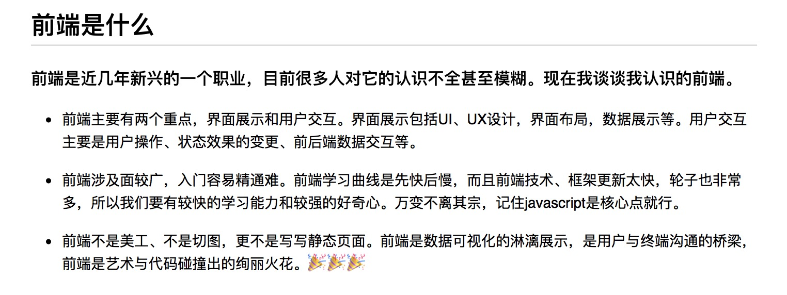
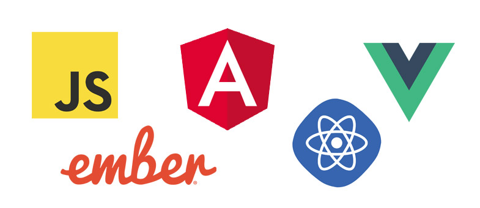
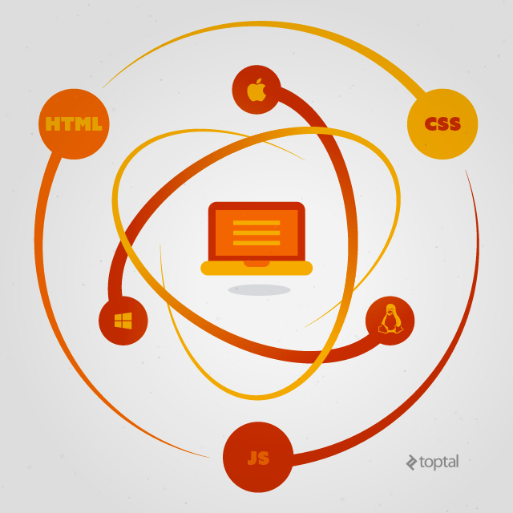
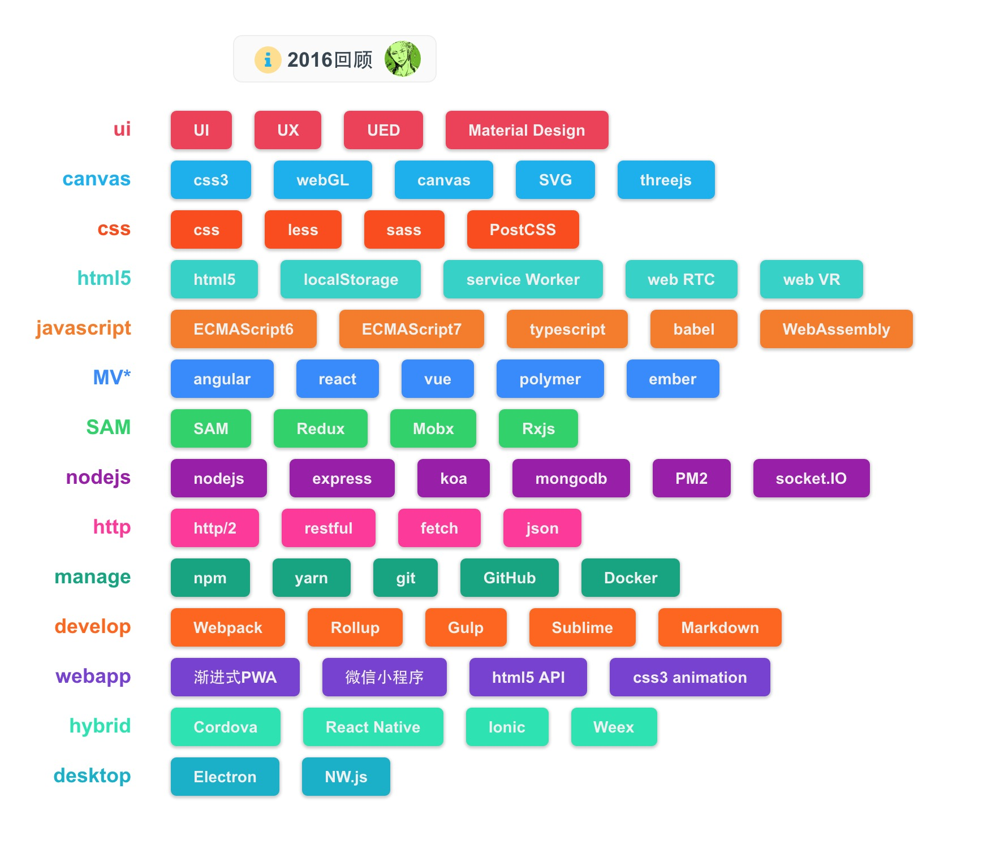

# 我的2016

时光荏苒，年关将至。趁着年前最后一天有点空闲时间，写点总结。

2016给我的感觉就是一个字：“变”。

我喜欢这个字，我喜欢变幻莫测的世界，喜欢体验不一样的生活，这和我“生命不息，折腾不止”的生活态度很契合。

世界正在高速的变化着，VR、AR、AI等正在改变我们的生活，但有些东西却永远不会改变，比如，那年仲夏夜的星空。

不管你要房子车子，还是追星辰大海，以不变应万变，活在当下，才是最好的状态。你高兴就好。

这一年发生了很多事，换了几份工作、背包去了六七个地方，还有当了3次伴郎😢😢😢。

这一年似乎又很平静，依然宅，依然每周打球、每周看海贼王，依然单身。。。

跑题了，还是来说说前端吧。

2016可谓是前端大爆发的一年，似乎聊天不聊点前端你就与世界脱节了😄😄。

那么前端是什么？我引用我之前写过的一段话来谈谈我对前端的认识。

### javascript的演变

> 路漫漫其修远兮，吾将上下而求索。

随着ECMAScript6、ECMAScript7的到来，js越来越向强类型语言靠拢了，出现了一些增强类型的子集语言，如Typescript、Dart。其中，微软的Typescript获得了较多用户的青睐，Google的angular2就是使用Typescript编写的。

WebAssembly是一种新的字节码格式。是由Google、Microsoft、Mozilla、Apple等几家大公司合作发起的一个关于面向Web的通用二进制和文本格式的项目。
WebAssembly可以被嵌入到已经开发好的JavaScript/HTML代码中，或者某款应用的主要框架可以使用 WebAssembly模块（如动画、可视化和压缩等），而用户界面仍然可以主要使用 JavaScript/HTML语言编写。
使用WebAssembly意味着精简的代码，更好的性能，更少的bug。

我使用过Typescript编写代码，并没有发现它有什么突出之处，反而给我有一种局限的感觉。当制定出条条框框来约束你不让你犯错时，这本来就是一件得不偿失的事情。我是崇尚自由的，虽然可能会付出一些代价，但还是不喜欢这些条条框框，我想活出自己的样子。当然，对于大型项目和团队协作，我不否认Typescript有一定的优势。正如Bjarne Stroustup说的：“JS会活得很好，因为世界上只有两种类型的语言：一类语言被人们不断的地吐槽，而另一类语言压根儿没人用！”

或许，用不了几年，javascript就会成为web世界的汇编语言。

### 框架

> 世界上本来没有路，走的人多了，也便有了路。

从angular到react再到vue，前端框架的热浪一波接一波，或许我们不该随波逐流，而应该驻足远眺，看看你究竟喜欢的是哪一个，然后再去追寻。

人生亦是如此，世间有太多值得追寻的事物，然而生命短暂，我们终其一生也不能体验世间所有的美好。所以，我们应该跟随自己的内心，勇敢的面对自己。唯有这样，我们才能找到自己的方向，遇见最好的自己。唯有这样，我们才能强大到温柔，而不至于软弱到虚伪。

#### MV*模式

再来说说设计模式吧。

MVVM：视图、视图模型、模型

如：Angular、Vue

SAM：状态、操作、模型

如：Redux、Mobx、RxJS

其中好坏只有自己亲自去体会，个人更倾向SAM设计模式。

其实框架如同招式，设计模式才是内功。我希望大家都能达到变换自如、任意挥洒的无招胜有招境界。那将是一个无框架时代。

### 工具

> 工欲善其事，必先利其器。

有了内功和招式，现在需要一把好剑了。

npm是nodejs的包管理工具，也是目前最流行的。yarn是Facebook开源的包管理工具，可缓存已安装的包，速度快。

webpack是自动化构建工具，可以看做是模块打包机，它做的事情是，分析你的项目结构，找到JavaScript模块以及其它的一些浏览器不能直接运行的拓展语言（Less，TypeScript等），并将其打包为合适的格式以供浏览器使用。

GitHub是代码管理工具，用于团队间协同工作。

Docker用来部署开发环境。

sublime是代码开发工具。

Markdown是文本编辑器，可用于文本编写。

熟练使用上面的几种工具，可以说是拿了一把前端的好剑在手。用它来劈荆斩棘、快意恩仇应该是没多大问题了。

### 端

> 道生一，一生二，二生三，三生万物。

很久很久以前，javascript只是用来写写页面的。然而现在，javascript能做所有的事情。

前端、后端、移动端、客户端、OS端都可以用js来开发了，还有Google PWA、微信小程序、webVR、nodejs+树莓派的智能家居等。前端界可谓前所未有的昌盛，一片欣欣向荣的景象。

然而，很多前端er都会在这个大潮中迷失方向、迷失自己，面对快速的变化无所适从，其实我们只要抓住事物的本质就不至于迷失。路虽有异，殊途同归，万变不离其宗，守住心中的纯真，就会迎来世界的温柔。

### UI、UX

> 天上的神明和星辰，人间的艺术与真纯，我们所敬畏和景仰的，莫过于此。

UI是打开用户大门的钥匙，UX是留住用户的糖果。

配色、布局、微交互，都是我们需要花时间去斟酌的。

我们所做的东西是给人使用的，所以一定要人性化。不管是用户第一眼看到会有一丝愉悦，还是使用过程中有一点乐趣，都是我们毕生所追求的。

我们不求能改变世界，若能为世界带来一丝能量，一点乐趣，足矣。

### 展望

年末火了一把的微信小程序，为html5和前端再添了一把火，试玩了一下小程序，并没有如宣传的那样有吸引力，然而现在温度也慢慢降下来了。

同样在年末火起来的还有共享单车。很早之前就探讨过IP和共享之间的关系，它们并不矛盾，而是相辅相成的。不管是精神上还是生活上，都给我们带来了改变和提升。它们应该是未来的趋势。

时间是单线程，人生到处是bug，遍历人间五味，找到符合内心的追求，那便是你前进的方向。然而怎样抉择，还得看心情。

生活如顽童，分不清戏虐与残忍。我们能做的就是接纳与包容。活在当下，享受生活。

夕阳西下，快下班了。明天的世界会是怎样，谁知道呢，谁在乎呢。
